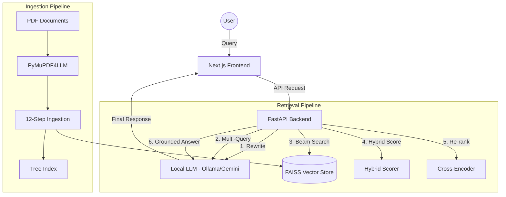

# Contexta Enterprise 🚀

[](https://fastapi.tiangolo.com/)
[](https://next.js.org/)
[](https://ollama.com/)
[](https://github.com/facebookresearch/faiss)
[](LICENSE)

**Contexta** is a privacy-preserving, fully offline enterprise RAG (Retrieval-Augmented Generation) system designed for institutional knowledge retrieval. Stop searching through endless folders; start finding precise answers directly from your documents.

---

## 🌟 Key Features

### 🛡️ Privacy First
- **100% Offline:** No data leaves your infrastructure. All processing, embeddings, and LLM calls happen locally via Ollama.
- **RBAC (Role-Based Access Control):** Granular permissions with four built-in roles: `Admin`, `Manager`, `Analyst`, and `Viewer`.
- **Audit Logs:** Track every action within the system for compliance and security.

### 🧠 Advanced RAG Pipeline
- **Multi-Query Strategy:** Automatically generates diverse query variants to improve retrieval recall.
- **Query Rewriting:** Aligns informal user questions with formal institutional terminology.
- **Hierarchical Beam Search:** Fast and precise retrieval using FAISS across document structures.
- **Hybrid Scoring:** Combines semantic similarity (50%), BM25 keyword matching (30%), and metadata relevance (20%).
- **Cross-Encoder Re-ranking:** Second-stage precision boost for the most relevant results.
- **Thinking Trace:** Transparently view the system's "thought process" for every query.

### 📁 Intelligent Ingestion
- **12-Step Pipeline:** Robust background processing for PDF documents.
- **Automated Summarization:** Hierarchical document indexing with LLM-generated summaries.
- **Citation Support:** Grounded answers with direct links back to source document excerpts.

---

## 🏗️ Architecture



---

## 🛠️ Technology Stack

### Backend
- **Framework:** FastAPI
- **LLM Engine:** Ollama (default) or Google Gemini
- **Embeddings:** Sentence-Transformers (`BAAI/bge-small-en-v1.5`)
- **Vector Store:** FAISS (CPU)
- **Document Parsing:** PyMuPDF4LLM, PyPDF
- **Task Management:** Custom SSE-based background worker pool

### Frontend
- **Framework:** Next.js 15+ (App Router)
- **State Management:** Redux Toolkit
- **Styling:** Tailwind CSS v4, Shadcn UI
- **Icons:** Lucide React
- **Notifications:** Sonner

---

## 🚀 Getting Started

### Prerequisites
- **Python:** 3.11 or higher
- **Node.js:** 18.x or higher
- **pnpm:** Recommended (or npm/yarn)
- **Ollama:** Installed and running locally

### 1. Setup Backend
```bash
cd server

# Install dependencies (using uv recommended)
pip install -e . --break-system-packages

# Pull the required models
ollama pull gemma3:4b    # Default text model
ollama pull llava:7b      # For vision tasks (optional)

# Run the server
uvicorn main:app --reload --port 8000
```
> **Note:** On the first run, check the server console output for the **automatically generated admin password**. The default username is `admin`.

### 2. Setup Frontend
```bash
cd frontend

# Install dependencies
pnpm install

# Run development server
pnpm dev
```

Open [http://localhost:3000](http://localhost:3000) in your browser.

---

## ⚙️ Configuration

Both the frontend and backend can be configured via environment variables.

### Backend (.env)
Create a `.env` file in the `server/` directory:
- `LLM_PROVIDER`: `ollama` (default) or `gemini`.
- `OLLAMA_MODEL`: The model name to use (e.g., `gemma3:4b`).
- `GEMINI_API_KEY`: Required if using Gemini.
- `RERANKER_ENABLED`: Set to `True` for higher precision (requires `cross-encoder` model).

### Frontend (.env)
The frontend connects to `http://localhost:8000` by default. Update your environment variables if your backend is hosted elsewhere.

---

## 📊 Default Roles

| Role | Permissions |
|------|-------------|
| **Admin** | Full system access, User management, Audit logs, Ingestion, Querying. |
| **Manager** | Ingestion, Document management, Querying, View Audit logs. |
| **Analyst** | Document viewing, Querying. |
| **Viewer** | Restricted querying, no document management. |

---

## 📁 Project Structure

```text
contexta/
├── server/                # FastAPI Backend
│   ├── core/              # RAG logic (Retriever, Scorer, LLM)
│   ├── routers/           # API Endpoints
│   ├── services/          # Orchestration layers
│   └── tree_indexes/      # Persisted FAISS indexes
├── frontend/              # Next.js Frontend
│   ├── app/               # App Router pages
│   ├── components/        # UI Components (Shadcn + Custom)
│   ├── store/             # Redux state management
│   └── lib/               # API clients and hooks
└── README.MD              # This file
```

---

## 📜 License

This project is licensed under the MIT License - see the [LICENSE](LICENSE) file for details.

---

## 👥 Contributors
- **Deepak Kumar Singh**

---
Built with ❤️ for Privacy and Knowledge.
